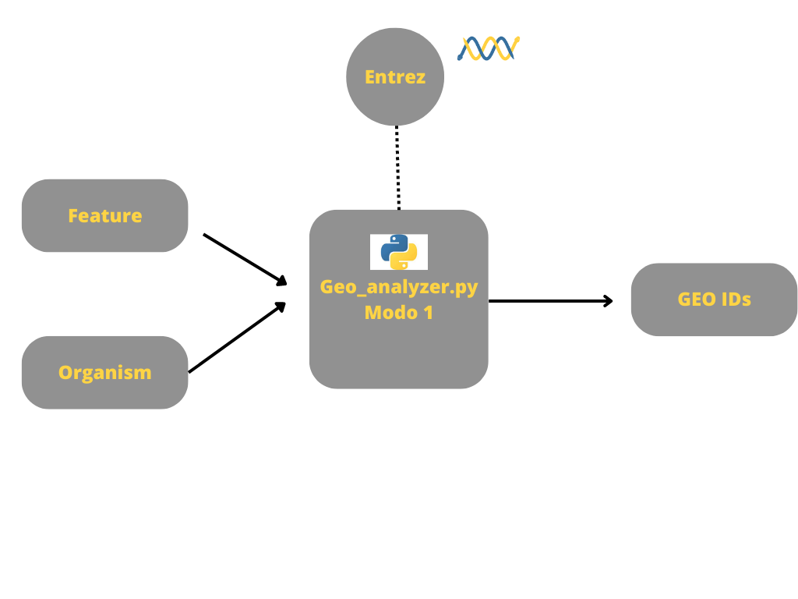
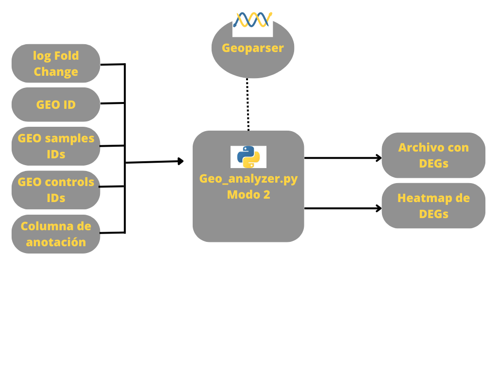

# Bio_poject

## Diseño

Se creó un programa con dos modos de uso principales.
En su primer modo de uso, realiza una búsqueda en la base de datos de Gene Expression Omnibus (GEO) con el módulo Entrez para la obtención de IDs de datos de expresión obtenidos mediante microarreglos de un organismo y una característica, ambas dadas por el usuario en los argumentos del programa.\
**Ejemplo**

~~~
python src/Geo_analyzer.py -m 1 -o 'Felis catus' -f 'trans fat'
~~~

**Salida**

~~~
GSE30040
~~~

**Diagrama de funcionamiento**

En el segundo modo de uso, un ID de GEO, IDs de controles y muestras, asi como la columna de anotacion de la plataforma, se toman para realizar un análisis de expresión diferencial con los datos de expresión asociados al ID, que regresa una tabla con los datos resultantes del análisis como los niveles de expresión, anotación del gen, y su ID de la plataforma de expresion; tambien se obtiene un heatmap con los genes expresados diferencialmente. Con este fin, se utilizó GEOparser, el cual es un módulo específico para el manejo de datos de microarreglos. Otros módulos, pandas, numpy y seaborn, se emplearon en los cálculos necesarios para la determinación de genes con expresión diferencial y, finalmente, se diseñó una clase con el formato de la tabla de los genes resultantes con atributos que faciliten la visualización de los datos gráficamente.
**Ejemplo**

```
python Geo_analyzer.py -m 2 -id GSE68849 -lfc 2\
-c GSM1684095,GSM1684097,GSM1684099,GSM1684101,GSM1684101 \
-s GSM1684096,GSM1684098,GSM1684100,GSM1684102,GSM1684104 -an Definition
```

**Salida**

```
Archivo con genes expresialmente diferenciados
Heatmap
```

**Diagrama de funcionamiento**


## Autores

[Victor Plascencia](https://github.com/ulisesplaper), [Diana Delgado](https://github.com/dianadg159/python_class), [Brenda López](https://github.com/beth-la), [Rogelio Ávila](https://github.com/Roglavsil)

## Objetivo

Creación de un programa útil para análisis de expresión diferencial de datos de expresión de la base de datos Gene Expression Omnibus (GEO).

## Versionado

## Resultados

entrez_module.py <- Las funciones contenidas nos permiten trabajar con la búsqueda de datos de expresión a través de GEOparse.
entez_module nos produce el query generado por el usuario y una lista de IDs listos para GEOparse.

Geo_analyzer.py <- Imprime en pantalla título, resumen, tipo, IDsde PubMed y IDs de plataforma del GSE producido en entrez_module.py
Regresa un archivo con un data frame con los genes diferencialmente expresados con base a los datos de la plaraforma de cada GSE, asi como un heatmap asociado.

dexs_class.py <- Hace gráficas con los datos de expresión diferencial de tabla que regresa de Geo_analyzer.py. Tiene dos atributos: un cluster map de los datos de expresión diferencial de controles y los tratados y otro que los IDs de los genes.

## Conclusion

Se diseñó una herramienta que ayuda a buscar diseños experimentales con datos de expresión obtenida mediante microarreglos que permitan analizar a través de gráficas y tablas la expresión diferencial de los mismos datos. A través de una cadena el usuario puede buscar datos de expresión en GEO que le permiten explorar y hacer análisis sobre esos datos para su posterior intepretación.
Esta herramienta es un primer acercamiento para saber los resultados esperados antes de tener un apropuesta experimental. Asimismo nos permite obtener una base para el análisis de datos nuevos y cómo obtenerlos a través de una metodología reproducible.
Tambien es una inicialización hacia nuevos proyectos y nuevas preguntas que se espera sean resuletas con un análisis más profundo basándose en los datos proporcionados con este.
Las versiones se generaron manualmente

## Estructura

- data: Archivos input para programas

- results: Archivos output de programas
- docs: documentos auxiliares del repositorio

- src: Scripts de Python

- readme

## Pre-requisitos

python 3.10.2
